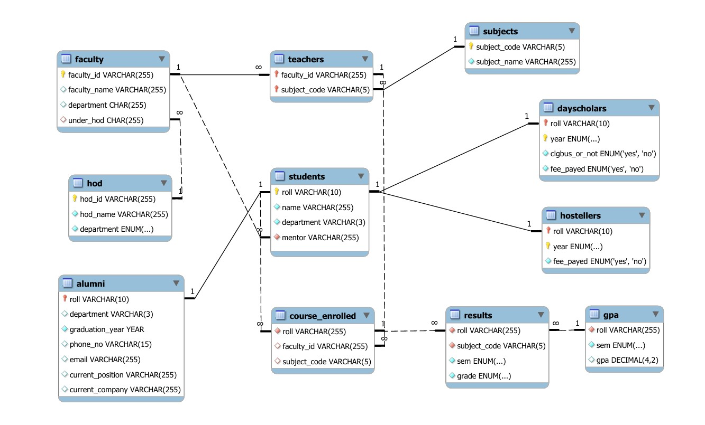

# College Database Management System (clgdb)

This project is a comprehensive database management system for a college, designed to efficiently manage data related to students, faculty, courses, results, and more. The system is implemented using MySQL and includes various tables with well-defined relationships and constraints to ensure data integrity and consistency.

## ER Diagram



## Features

### 1. Comprehensive Data Management
- **Students**: Track personal details, department, and mentors.
- **Faculty**: Manage faculty details and their corresponding departments and heads of departments (HODs).
- **Courses and Subjects**: Store information about the courses offered and the subjects taught.
- **Hostellers and Day Scholars**: Separate tracking of residential status and associated details.
- **Results and GPA**: Record student grades and calculate GPA.

### 2. Well-Defined Relationships
- **One-to-Many Relationships**: For example, a department can have multiple faculty members.
- **Many-to-Many Relationships**: Through associative entities like `teachers` which connect faculty and subjects.
- **Foreign Key Constraints**: Ensuring referential integrity across tables.

### 3. Advanced SQL Features
- **Triggers**: Automatic enforcement of rules such as preventing duplicate entries across `hostellers` and `dayscholars`, and calculating GPA.
- **Unique Constraints**: Ensuring unique entries where necessary, such as unique roll numbers in the `students` table.
- **Enum Types**: Standardizing categorical data such as departments and years.

## Database Structure

### Tables and Columns
- **students**: Contains roll number, name, department, and mentor.
- **faculty**: Contains faculty ID, name, department, and the corresponding HOD.
- **hod**: Contains HOD ID, name, and department.
- **courses_enrolled**: Links students to the courses they are enrolled in.
- **subjects**: Contains subject code and name.
- **teachers**: Links faculty to the subjects they teach.
- **results**: Records student grades for specific subjects and semesters.
- **gpa**: Stores GPA calculated from student results.
- **hostellers**: Details about students staying in hostels, including fee payment status.
- **dayscholars**: Details about day scholars, including bus usage and fee payment status.
- **alumni**: Information about graduated students, including their current positions and companies.

### Key Relationships
- **One-to-Many**: Between HOD and faculty, faculty and students, faculty and subjects.
- **Many-to-Many**: Between students and courses.
- **One-to-One**: Between students and dayscholars/hostellers, alumini and students.

## Triggers and Constraints
- **Preventing Duplicate Entries**: Trigger to ensure a student cannot be both a hosteller and a day scholar in the same year.
- **GPA Calculation**: Trigger to automatically calculate and insert GPA after inserting results.
- **Alumni Restriction**: Trigger to prevent further modifications of a student’s record once they are marked as alumni.

## Example Queries
- **Get hostellers who haven't paid the fee**:
  ```sql
  SELECT s.name, h.roll 
  FROM hostellers h 
  JOIN students s ON h.roll = s.roll 
  WHERE h.fee_payed = 'no';
  ```
- **Get day scholars using the college bus who haven't paid the fee**:
  ```sql
  SELECT s.name, d.roll 
  FROM dayscholars d 
  JOIN students s ON d.roll = s.roll 
  WHERE d.clgbus_or_not = 'yes' AND d.fee_payed = 'no';
  ```


## Conclusion

This project demonstrates a robust and scalable database design for a college management system, utilizing advanced SQL features to maintain data integrity and automate complex tasks. It serves as a foundation for managing a wide array of academic and administrative data efficiently.

---

